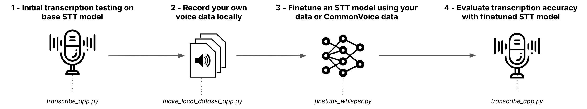

# **Speech-to-Text Finetune Blueprint**

  

Blueprints empower developers to easily integrate AI capabilities into their projects using open-source models and tools.

These docs are your companion to mastering the **Speech-to-Text Finetune Blueprint** —a local-friendly approach for finetuning an STT model on your own data or on CommonVoice data.

### Built with
   

---

### 🚀 **Get Started Quickly**
#### _Start transcribing with HuggingFace models or finetune your own custom STT models in minutes:_
- **[Getting Started](getting-started.md):** Quick setup and installation instructions.

### 🔍 **Understand the System**
#### _Dive deeper into how the Blueprint works:_
- **[Step-by-Step Guide](step-by-step-guide.md):** A detailed breakdown of how to use the Blueprint with a suggested user-flow.
- **[API Reference](api.md):** Explore the technical details of the core modules.

### 🎨 **Make It Yours**
#### _Customize the Blueprint to fit your needs:_
- **[Customization Guide](customization.md):** Bring Your Own Dataset!

### 🌟 **Join the Community**
#### _Help shape the future of Blueprints:_
- **[Future Features & Contributions](future-features-contributions.md):** Learn about exciting upcoming features and how to contribute to the project.

Have more questions? Reach out to us on Discord and we'll see how we can help:

